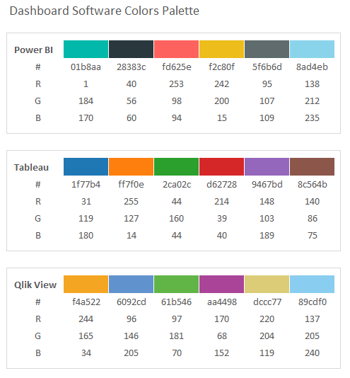
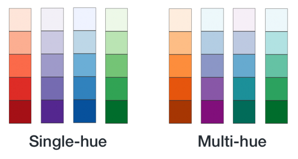

# Dashboard Design Guideline
Here is the place to store all materials and experience for presentation or reporting purpose.

## Tools
- Excel
- PPT
- PDT
- Qlikview
- Tableau
- D3.js

## Principles of Visual Design for Dashboards

> "Form follows function"

> "Rule of 3"

> "No 3D chart"

>

## Dashboard / Chart Gallery

## icon pack
- https://www.freepik.com/
- https://www.flaticon.com/

## Colors Palettes
- https://colorhunt.co/

## Bibles
- **Storytelling with data: A Data visualization for Business Professionals** by Cole Nussbaumer Knaflic
